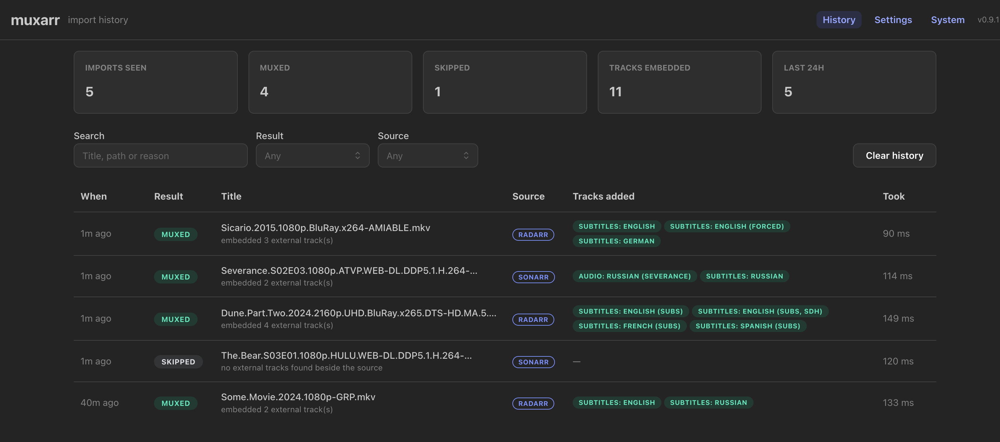
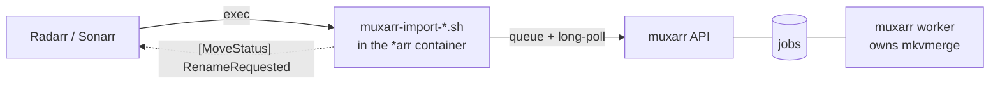
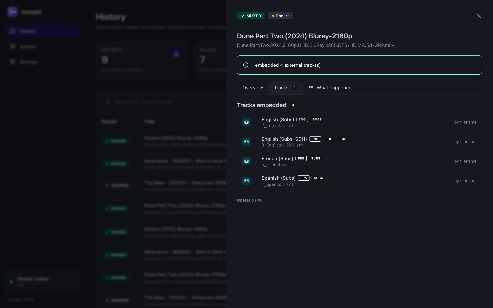

# Muxarr

[](https://github.com/zxibizz/muxarr/actions/workflows/ci.yml)
[](LICENSE)
[](https://github.com/zxibizz/muxarr/pkgs/container/muxarr)

**Sidecars in, one clean MKV out.** Muxarr embeds external audio and subtitle
tracks into the video container at the moment Radarr/Sonarr import a download,
using the **Import Using Script** hook.

No sidecar `.srt` your player has to be told about. No second file to keep next
to the first one forever. No manual pass with mkvtoolnix after every release
that ships a dub in its own folder.

```
 the release Radarr/Sonarr grabbed        what lands in your library

 Some.Movie.2024.1080p-GRP/               Some Movie (2024)/
 ├── Some.Movie.2024.1080p-GRP.mkv        └── Some Movie (2024) Bluray-1080p.mkv
 ├── Subs/2_English.srt                       ├── video     h264
 ├── Subs/3_English.SDH.srt                   ├── audio     English
 └── RUS Sound [Group]/dub.mka                ├── audio     Russian      <- dub.mka
                                              ├── subtitles English      <- 2_English.srt
                                              └── subtitles English SDH  <- 3_English.SDH.srt
```

It runs where the tracks already are — inside your existing \*arr stack, with no
change to how you download, rename or organise anything.

- **Stream-copy only.** No transcoding, ever. A mux costs one sequential read
  and one sequential write; a 40 GB remux is disk-bound, not CPU-bound.
- **The download folder is read-only.** Muxarr never writes, renames or deletes
  anything on the source side, in any transfer mode. Seeding is unaffected, and
  cleanup stays with your download client's Completed Download Handling.
- **Fail safe by construction.** Any error degrades to `DeferMove`, and
  Radarr/Sonarr perform a completely normal import — the worst case is the
  import you would have had anyway. The shim exits 0 on every path up to the
  point a remux is queued; after that, a lost result exits non-zero and fails
  the import, because deferring would race a mux that may still be running.
- **Staging lives in the destination directory**, so the final step is an atomic
  rename rather than a cross-device copy.
- **Every decision is on the record.** Each import keeps the reasoning that
  produced it — what the source already held, which sidecars were found, why
  each was taken or passed over — and the UI shows it back to you.



## Quick start

Muxarr sits next to the Radarr/Sonarr stack you already run, as its own small
compose project.

1. **Start Muxarr.** Save this as `compose.yaml` in a new directory:

   ```yaml
   services:
     muxarr:
       image: ghcr.io/zxibizz/muxarr:0.9.2
       container_name: muxarr
       restart: unless-stopped
       environment:
         PUID: 1000                           # same as Radarr/Sonarr
         PGID: 1000
         MUXARR_READ_ROOTS: /downloads:/media # the container-side paths below
       volumes:
         - ./config:/config
         - /opt/muxarr/shims:/shims           # Radarr/Sonarr mount this too
         - /srv/downloads:/downloads          # exactly as in Radarr/Sonarr
         - /srv/media:/media
       ports:
         - "8710:8710"
   ```

   Then:

   ```sh
   docker compose up -d
   ```

   The UI is now on <http://localhost:8710>. The first visit asks you to create
   the login; then copy the **API key** from Settings → Security for the next
   step.

   > Every media path must be mounted at the **same path** in the \*arr
   > containers and in Muxarr. Radarr/Sonarr pass absolute paths; if they mean
   > different things in each container, Muxarr rejects them and defers.

   `PUID`/`PGID` must own your library: Muxarr creates the final file.

2. **Wire up Radarr and Sonarr.** In *their* compose file, add to each service:

   ```yaml
       environment:
         MUXARR_URL: http://<muxarr-host-ip>:8710   # not localhost: that is this container
         MUXARR_API_KEY: <from Settings → Security>
       volumes:
         - /opt/muxarr/shims:/config/scripts:ro
   ```

   Then `docker compose up -d` there too. The shims ship inside the Muxarr
   image, which republishes them into `/opt/muxarr/shims` on every start, so
   nothing needs a checkout of this repo and an upgrade reaches Radarr/Sonarr
   without restarting them.

3. **Configure Radarr/Sonarr.** Settings → Media Management → *show Advanced* →
   Importing:
   - tick **Import Using Script**
   - set **Import Script Path** to `/config/scripts/muxarr-import-radarr.sh` in
     Radarr, or `/config/scripts/muxarr-import-sonarr.sh` in Sonarr
   - leave **Import Extra Files** as you had it; Muxarr suppresses the duplicate
     sidecar copy only for imports it actually muxed

4. **Check it.** `docker exec radarr curl -s http://<muxarr-host-ip>:8710/healthz`,
   then import something and watch `docker logs -f muxarr`.

   > `worker_alive` in that response must be `true`. If it is not, imports will
   > queue with nothing to run them and every one of them will eventually fail.

Prefer one compose file for everything? Paste the `muxarr` service into it
instead and use `MUXARR_URL: http://muxarr:8710`; the notes at the end of
[compose.example.yaml](compose.example.yaml) say what else changes, and how to
join the \*arr network from a separate stack. To run the API and the worker as
separate containers on Postgres, start from
[compose.split.example.yaml](compose.split.example.yaml).

## How it fits together



The API and the worker are separate processes. The API only queues work and
reports on it; the worker claims a job, muxes, and writes the result back. That
split means a worker crash or restart cannot take the API down with it, and a
long mux never blocks the shim's polls. By default one container runs both; with
a Postgres database they can also run as separate containers from the same image
(`MUXARR_MODE=web` / `worker`, see [Container modes](docs/configuration.md#container-modes)).

The shim queues the remux and then long-polls for the result: each request is
held open by the API until the job changes state, so the shim learns about
completion within a second while no single request lives long enough for a
reverse proxy to time it out. A dropped connection is simply retried against the
same job id, which the API treats idempotently.

There is one shim per app — `muxarr-import-radarr.sh` and
`muxarr-import-sonarr.sh` — because each reads a different set of \*arr
environment variables. Both are dependency-free POSIX `sh` (needs only `curl` or
`wget`). All the heavy dependencies live in the Muxarr container.
[docs/architecture.md](docs/architecture.md) goes deeper.

## Web UI

nginx inside the container serves a React/Mantine UI on the same port (default
<http://localhost:8710>) and reverse-proxies the API behind it, showing every
import it has been handed — including the ones it skipped, which is usually the
question you actually have.

Each row expands into the full decision: the paths involved, which tracks were
embedded and where each came from, which sidecars were passed over *and why*,
and the step-by-step log of the import that produced it — down to the mkvmerge
command line, if you scroll that far.



Imports that have not settled yet are listed the same way and follow their log
live, so a mux that will take an hour is something you can watch rather than
guess at. The history is stored in SQLite under `/config` (or in Postgres, if
`MUXARR_DB_URL` points there), so it survives restarts — mount that volume or you
will lose it.

Access works the way it does in the \*arr apps: the UI has its own login, and
Radarr/Sonarr present an API key. Both are managed under Settings → Security;
see [configuration](docs/configuration.md#authentication) for the options.

## Configuration

Most settings can be changed from the **Settings** page in the web UI, which
takes effect within a few seconds — no restart, in either process. The rest are
environment variables on the daemon; `MUXARR_READ_ROOTS` is the only required
one.

`MUXARR_READ_ROOTS` limits which paths Muxarr will touch. Radarr/Sonarr send
absolute paths over HTTP, and those paths end up on mkvmerge's command line. So
each path is fully resolved, symlinks included, and must land inside one of
these roots, or the import is deferred. The limit applies to writes as well: the
finished file has to sit under a root, and Muxarr only ever writes into that
file's own directory. Set it to your download and library paths as the container
sees them, separated by colons, and nothing wider. In particular, leave `/config`
out, since it holds the database. There is no default, because any guess would
either break imports or switch the check off.

A variable that is actually set in your compose file **wins and locks the
field**: the UI renders it read-only and names the variable, so compose stays
the single source of truth for anything you have configured there.


Every variable, the shim's own settings and the optional **AI mode** for
releases the filename rules cannot read are in
[docs/configuration.md](docs/configuration.md).

## Documentation

- [Configuration](docs/configuration.md) — every variable, and AI mode
- [Troubleshooting](docs/troubleshooting.md) — the questions the logs answer
- [Upgrading](docs/upgrading.md) — tags, migrations, backups
- [Architecture](docs/architecture.md) — processes, layers, the import pipeline
- [Changelog](CHANGELOG.md)

## Development

The whole stack — API, worker and the Vite dev server, with hot reload on both
sides — runs in one container that also ships mkvtoolnix and ffmpeg:

```sh
make dev      # docker compose -f compose.dev.yaml up --build; UI on :5173
make check    # lint, typecheck and test both halves
```

`make help` lists the rest. The backend is Python 3.14 with FastAPI and
SQLAlchemy, strictly typed and layered with dependencies pointing inward; the UI
is React 19, Mantine 9 and TanStack Query, with its API types generated from the
backend's OpenAPI schema. [docs/architecture.md](docs/architecture.md) explains
how the pieces fit, and [CONTRIBUTING.md](CONTRIBUTING.md) the rules the test
suite enforces.

## Requirements

`mkvtoolnix` is required at runtime. `ffmpeg` is optional, used as a probe
fallback and to generate test fixtures.

## Contributing

Bug reports, feature requests and pull requests are welcome. See
[CONTRIBUTING.md](CONTRIBUTING.md) for the development loop and the handful of
architectural rules the test suite enforces, and
[SECURITY.md](SECURITY.md) for the threat model and how to report a
vulnerability privately.

## Licence

[MIT](LICENSE).
