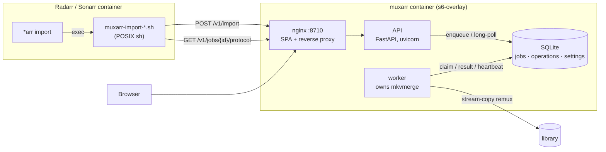
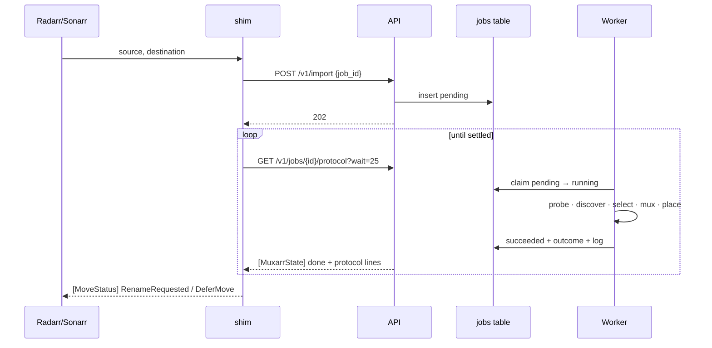
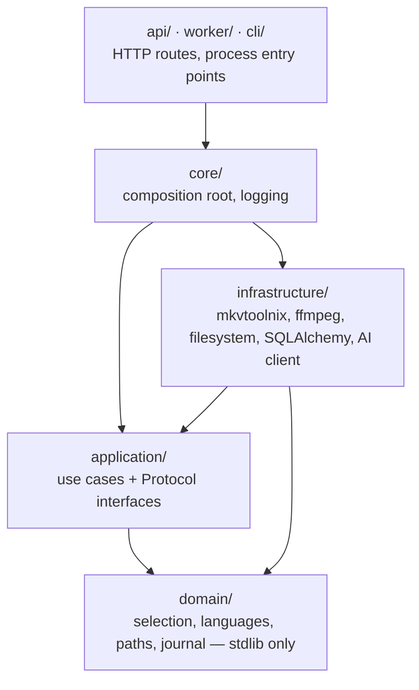

# Architecture

muxarr is two processes around one table, plus a shell script that runs somewhere
else entirely.



- **The API never muxes.** It queues work and reports on it. That is what lets
  the worker be restarted, or moved to the machine that holds the library, on
  its own.
- **The worker is the only thing that needs mkvmerge** or write access to the
  library. It claims one job at a time per slot with a conditional `UPDATE`
  (SQLite has no row locks), runs the synchronous mux on a thread, and writes
  the outcome and its log back to the job row.
- **The shim long-polls.** Each poll is held open by the API until the job
  changes state, so completion is noticed within a second, while no single
  request lives long enough for a proxy to cut it. The job id is chosen by the
  shim, so a retried submission re-attaches instead of starting a second mux.

## An import, end to end



Every unexpected condition inside the import becomes `DeferMove`, which makes
the \*arr app import the file itself as though muxarr were absent. A job in
state `failed` therefore means the daemon itself broke; the shim fails that
import rather than let \*arr move a file a mux may still be rewriting.

## Backend layers



Dependencies point inward, and `tests/test_architecture.py` enforces it by
walking every import. Use cases depend on Protocols in
`application/interfaces/`; the adapters that satisfy them live in
`infrastructure/` and are wired together only in `core/container.py`.
[AGENTS.md](../AGENTS.md) lists the rest of the rules the code holds itself to.

## Frontend

```
services/frontend/src/
  api/          fetch client, TanStack Query hooks, types generated from OpenAPI
  app/          providers, theme, router, shell
  components/   small presentational pieces shared by features
  features/     history · activity · system · settings
  lib/          formatting
```

The wire types are generated from the backend's own schema
(`make gen-api`), and a backend test fails if the committed schema drifts from
the live one — so a renamed field breaks the build, not the browser.

## Repository layout

```
services/backend    FastAPI daemon and worker
services/frontend   React + Mantine SPA
scripts/            the *arr-side shims, rendered from scripts/src/
cicd/containers/    s6-overlay definitions for the production image
docs/               this directory
```

## CLI

```sh
cd services/backend
uv run python -m src.cli inspect video.mkv    # list tracks in a container
uv run python -m src.cli plan    video.mkv    # show what would be embedded
uv run python -m src.cli mux     video.mkv --out out.mkv
uv run python -m src.cli serve                # run the API
uv run python -m src.cli openapi              # print the API schema
uv run python -m src.worker                   # run the worker
```
